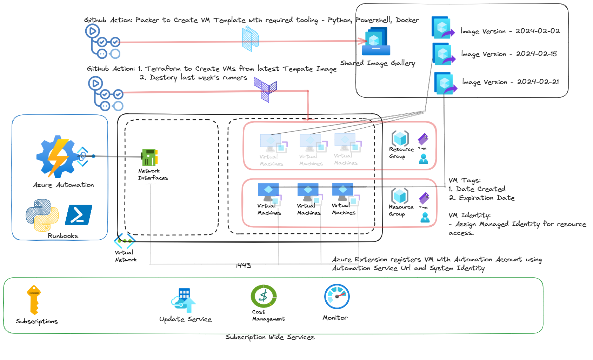

# Azure Automation Hybrid Worker Demo 

## Overview 
Azure Automation is a service that allows you to automate tasks in Azure. Azure Automation allows you to run runbooks in the cloud or on-premises. It is a standard command-and-control architecture, where the Azure Automation service sends jobs to workers. The workers performs the jobs.  Sometimes these jobs require access to Azure resources that are not accessible from the public internet. In this case, you can use a Hybrid Worker. 

* A Hybrid Worker is a virtual machine that is deployed in your Azure subscription. The Hybrid Worker is registered with the Azure Automation service. 

* This demo shows how to deploy a disposalable Hybrid Workers using Terraform and Packer without any interaction with the actual virtual machines.  All software is installed via [Packer](./infrastructure/packer/azure_linux.pkr.hcl) into a Golden Image or on after creation with [Cloud Init](./infrastructure/runners/cloud-init.txt).

* The Hybrid Workers are registered with the Azure Automation service using the new Azure VM Extension. The traditional agent installation model is set to expire in later 2024/2025.
  * The extension takes one argument - the Hybrid Service Url - which is a property of the Automation Account.
  * The new extension allows the machine to be registered with the Azure Automation service without any interaction with the actual virtual machines. 
  * Please see [Azure Automation Hybrid Worker Extension](https://learn.microsoft.com/en-us/azure/automation/automation-hybrid-runbook-worker#benefits-of-extension-based-user-hybrid-workers) for more information around the benefits of the extension model.
  * The extension is configured to automatically update when new versions are released.
  * The extensions are deployed with Terraform when the Hybrid Workers is created using the [azurerm_virtual_machine_extension](./infrastructure/runners/worker.tf#L72) resource

* The each deployment creates a unique resource group based on random id. Virtual Machines are given a random id based on the resource group id and another unique id.

* The machines are registered with Azure Update Manager by setting `patch_mode` and `patch_assessment_mode` to `AutomaticByPlatform` in the [azurerm_virtual_machine](./infrastructure/runners/worker.tf#L21) resource.

* The machines are assigned an Managed Identity. Role assignments can be created to this identity to allow the Hybrid Worker to access Azure resources. 

* An Expiration tags is defined that will used to destory the resources after a certain period of time.

* The Hybrid Workers are intended to be short lived and to be destory within a week of creation. Replaced by a new set of workers.

__NOTE:__ As always, this repo is for demostration purposes only. It is not intended for production use as is..

## Components
Component | Usage
------ | ------
Azure Automation | Automation Account for Runbooks 
Azure Virtual Machine | Hybrid Workers
Azure Virtual Network | Virtual Network for Hybrid Workers
Azure Shared Image Gallery | Golden Image for Hybrid Workers
Azure Update Management | Patching for Hybrid Workers

## Pros and Cons of Hybrid Worker vs Other Job Schedulers in Azure
Pros   | Cons
------ | ------
Azure Automation can run any existing Python or PowerShell Script without (any?) customizatoins | Machines still must be managed and patched.  Azure Update Manager can assist and does not require interactive login to the machine.
Extension based automically updates when new versions are released | VM based model does not automatically scale out.  Requires an execution of the Terraform command to create additional workers.
Azure Automation provides a built in Python and PowerShell module repository | Azure Container Apps Jobs require each job/script to provide all dependencies in the container image. 
Does not execute Containres easily | Azure Container Apps Jobs executes containers automatically and can scale out using event triggers.
Azure Automation integrated with Azure Monitor and Log Analytics | Azure Container Apps Jobs integrated with Azure Monitor and Log Analytics |
Azure Automation schedules jobs by Cron syntax | Azure Container Apps Jobs schedules jobs by Cron syntax 
Azure Automation has extensive logging and auditing | Azure Container Apps Jobs has some degreee of logging and auditing

# Architecture

## Examlple Setup
__NOTE:__ _This [setup](./docs/setup.md) is an example of the architecture below using Taskdev_

  
